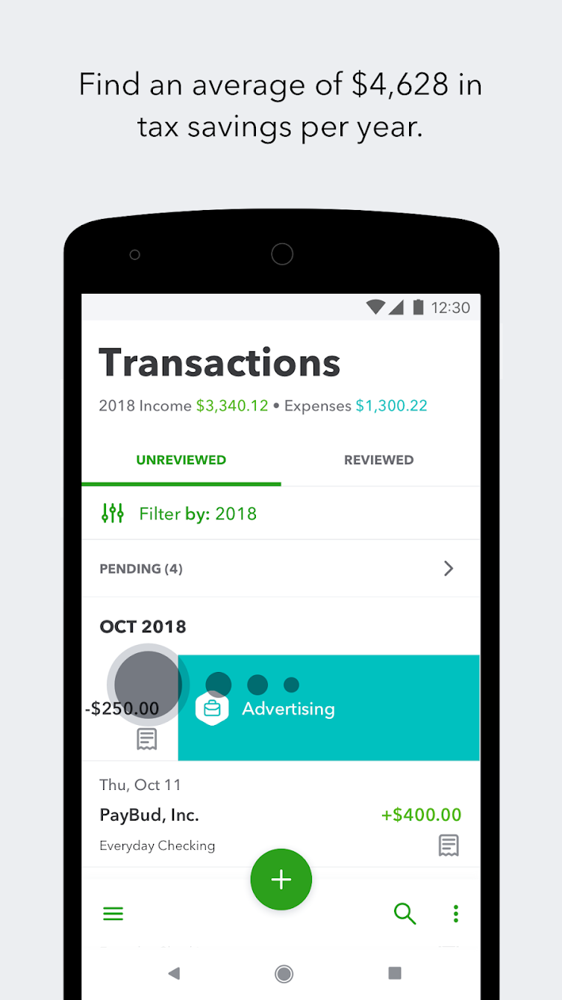

# MVP+

or MVP*

Empty states, onboarding users, syncing data, "fun" feature

MVP + Sticky

---

Mvp for app like things you should do as a human. Diet, exercise, doctor visits

---

What is the "app formula"?

Make failure cost less by building the simplest __useful__ thing, plus:

- Fun is a feature
  - Helps make an app "sticky" - a user will be more likely to come back to it
- Ask for reviews. They won't come on their own.
  - Ask after many uses of app. Do it in a casual, non-modal way.

---

Keep it clean and fast. QuickBooks Self-Employed is a great example. Uses native UI, uncluttered, nothing that really screams their brand. LIkely a good utility.

https://play.google.com/store/apps/details?id=com.intuit.qbse

---

[The Tiny Product Manual](https://marc.withcoach.com/the-tiny-product-manual)

# MVP*
The level just about MVP+. Where you add things that you really kind of need, like the "Please review this" modal.

## Please give us a review

## Feature Flags

## Types of users
Friendly for first-timers.
Configurable for power-users.

was actually thinking about this in regards to games like wow that have a pretty mediocre gui. But I remember addons were to tweak and add/subtract for the default gui.

---

Are you covering the new user?

Onboarding, empty list state, etc

Are you covering the curious user? Empty state that isn't likely. THinking about 1Password and it's embaraced bear when you mess up enough times.

## Tips
Don't overthink it. Pick direction, then learn and reflect. don't spend time agonizing in the moment.

You want users not frustrated with an experience and demanding more (the Apple way).

You are what you measure, so choose carefully