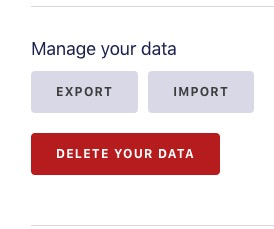
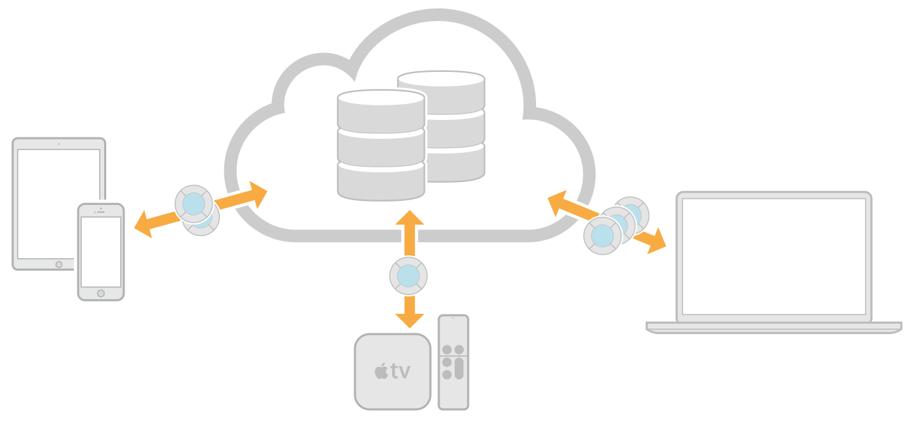

# App Data Backup/Sync

# How it is presented in settings

# iOS/macOS
## Sync (CloudKit)

Since CloudKit is deeply tied to Apple’s operating systems and devices, it’s not suitable for applications that require a broader range of device support, such as Android or Windows clients. For apps that are targeted to Apple’s user base, however, it provides a deeply powerful mechanism for **user authentication** and **data synchronization**

https://www.toptal.com/ios/sync-data-across-devices-with-cloudkit

https://medium.com/@guilhermerambo/synchronizing-data-with-cloudkit-94c6246a3fda

> CloudKit Solves The Synchronization Problem:
> In this article, I’ve explored the core CloudKit API mechanism for keeping data in sync between multiple iOS clients.
>
> Note that the same code will work for macOS clients as well, with slight adjustments for differences in how notifications work on that platform.

image from https://developer.apple.com/library/archive/documentation/DataManagement/Conceptual/CloudKitQuickStart/Introduction/Introduction.html

# Android
## Sync
## With Drive
No longer a hidden Apps folder.

Now use REST API, which is probably limited: https://github.com/gsuitedevs/android-samples/tree/master/drive/deprecation

Yikes, basically, don't use Drive:
> Warning: most Drive Android API clients which require an offline-first model are storing app data. App data support is likely to be removed from Drive in the future, and you should switch to a non-Drive solution (e.g. Cloud Firestore) to avoid a second migration effort.

Official docs say to use Android Drive API https://developer.android.com/guide/topics/data/backup, which lands you on a page saying it is deprecated https://developers.google.com/drive/android/ that links to a page mentioning the current solution will be phased out: 
> Clients requiring app data storage are strongly encouraged to migrate to a non-Drive solution such as Cloud Firestore.
> 
> https://developers.google.com/drive/android/deprecation

## Backup
Auto Backup only runs every 24 hours, the device is idle and charging, and user has enabled Backup & Reset in Settings. BLEH!

https://developer.android.com/guide/topics/data/autobackup

https://developer.android.com/guide/topics/data/backup