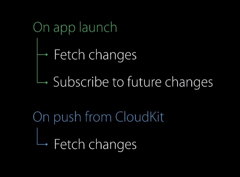

[What's New in iOS 11 \- Sessions by Pusher](https://pusher.com/sessions/meetup/swmobile/whats-new-in-ios-11)

# CloudKit

- [How to Sync User Data Across iOS Devices with CloudKit \| Toptal](https://www.toptal.com/ios/sync-data-across-devices-with-cloudkit) hands down most helpful
- [CloudKit Best Practices \- WWDC 2016 \- Videos \- Apple Developer](https://developer.apple.com/videos/play/wwdc2016/231/) start by checking user's auth status
- [Introduction to CloudKit · Introduction \| raywenderlich\.com](https://www.raywenderlich.com/3413-introduction-to-cloudkit/lessons/1)
- [CloudKit Tutorial \- iOS & Swift Tutorial](https://www.ralfebert.de/ios/tutorials/cloudkit/)

## Sharing between apps
[ios \- Can you share data on CloudKit between different apps \- Stack Overflow](https://stackoverflow.com/questions/33478860/can-you-share-data-on-cloudkit-between-different-apps)

## Caching
> icloud is single source of truth. Devices have local cache. CloudKit is the glue.

From the above WWDC video

[Maintaining a Local Cache of CloudKit Records](https://developer.apple.com/library/archive/documentation/DataManagement/Conceptual/CloudKitQuickStart/MaintainingaLocalCacheofCloudKitRecords/MaintainingaLocalCacheofCloudKitRecords.html)
