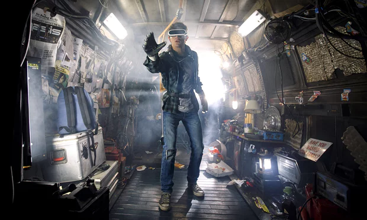

# Locational Independence
I want to live a life that does not depend on a certain location. This has many implications: relationships, work, play.

This question also seems relevant for a future where space travel is common. What will people do when they are marooned on a ship or planet?

## Relationships

Either maintain relationships using realtime Hangouts or **asynchronously** via texting, chat rooms, etc, or co-locate friends in something like a commune and be able to work remotely.

In the real world, I can’t expect any on these things to happen 100%.

How about this problem https://www.wired.com/story/why-teens-arent-partying-anymore/ ? Maybe a tool like online dating would be good for connecting those in the area you just moved to with similar interests. And just like dating, there’d be no issues with saying “this isn’t working out”. It is just a part of life.

How to prevent using something like Facebook as your main tool to stay connected?

[The year we wanted the internet to be smaller - The Verge](https://www.theverge.com/2017/12/28/16795090/internet-community-2017-post-mortem-tumblr-amino-drip-tinyletter) mentions that we want to be in small communities, and that this is a problem with Facebook. I think this is actually spot on.

> We can see this longing for community — and specifically, the sort of small, weird communities that populated and defined the early internet — everywhere.

So, we want to be a part of small communities, but we currently have trouble letting go of past relationships. I think this is good and bad. Through the years, you’ll collect many friends whom you haven’t seen for years. Sometimes it is best to accept that you’ve just grown apart and let them be. Other times, it can be wonderful to reconnect after so many years. Hard to say what the best option is, really.

Perhaps all apartments should have shared eating spaces to encourage connections? Much like college dorms.

## Co-Location via internet

[Spielberg's Ready Player One – in 2045, virtual reality is everyone's saviour | Film | The Guardian](https://www.theguardian.com/film/2018/jan/02/steven-spielberg-ready-player-one-in-2045-virtual-reality-is-everyones-saviour)

